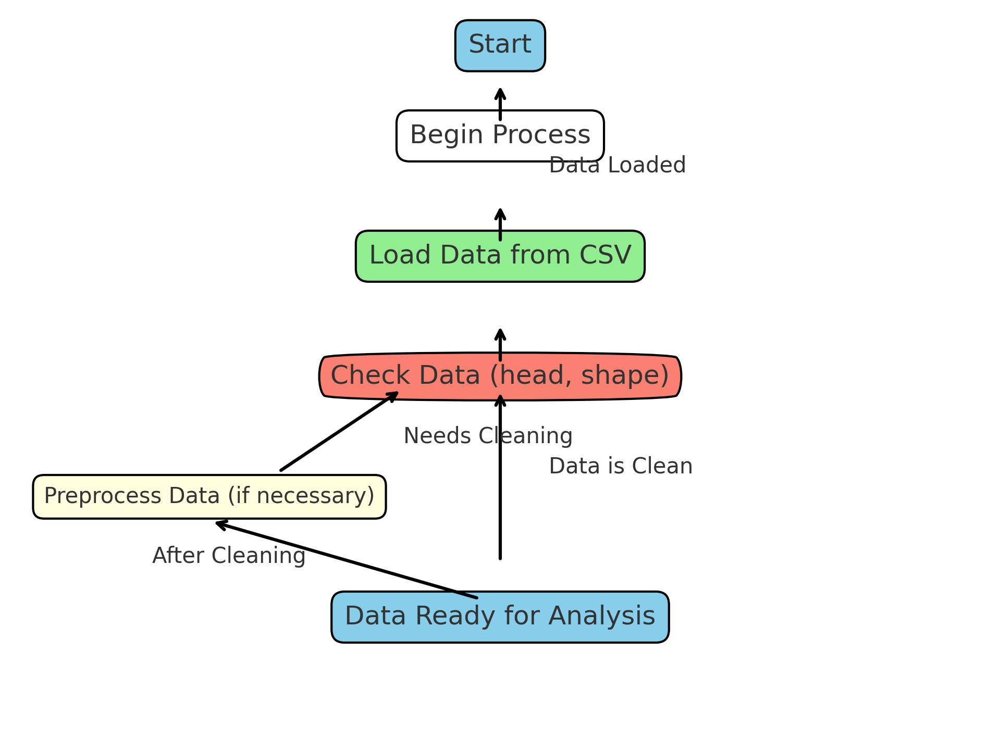
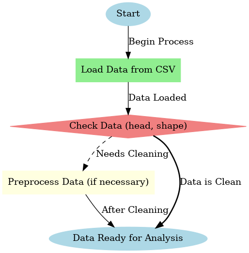

# Permintaan Pemesanan Hotel
<div align="center">
<a href="https://github.com/ardhian9/pemesanan-hotel">
        
</a>
</div>

## Pendahuluan
### Pernyataan Masalah
Dalam dunia perhotelan, memahami pola reservasi pelanggan dan faktor yang memengaruhi pembatalan reservasi adalah hal yang sangat penting. Tingkat pembatalan yang tinggi dapat memengaruhi pendapatan dan operasional hotel. Oleh karena itu, hotel perlu menganalisis data reservasi untuk mengidentifikasi tren, pola, dan faktor utama yang memengaruhi pembatalan.

**Mengapa ini penting?**
Proyek ini memberikan wawasan strategis bagi manajemen hotel untuk mengoptimalkan operasional, meningkatkan kepuasan pelanggan, dan meminimalkan kerugian akibat pembatalan reservasi. Selain itu, analisis ini juga dapat membantu dalam segmentasi pelanggan untuk mendukung strategi pemasaran yang lebih efektif.

### Rencana dan Metodologi
Proyek ini dirancang untuk memberikan solusi berbasis data terhadap permasalahan di atas dengan langkah-langkah berikut:
1. **Pengumpulan Data**: Menggunakan dataset "Hotel Bookings" yang mencakup informasi lengkap tentang reservasi, pembatalan, dan perilaku pelanggan.
2. **Pembersihan dan Persiapan Data**: Melakukan pembersihan data seperti mengisi nilai yang hilang, normalisasi teks, dan pembuatan variabel baru.
3. **Eksplorasi Data**: Mengidentifikasi pola dasar melalui statistik deskriptif dan visualisasi.
4. **Analisis Lanjutan**: Menggunakan teknik analisis untuk memahami faktor-faktor kunci yang memengaruhi pembatalan reservasi dan tren reservasi berdasarkan waktu.
5. **Pelaporan**: Menyusun laporan naratif berbasis wawasan yang relevan dengan kebutuhan bisnis.

### Pendekatan dan Teknik Analisis
Untuk mengatasi masalah ini, digunakan beberapa pendekatan berikut:
- **Statistik Deskriptif**: Untuk memberikan gambaran awal tentang dataset, termasuk distribusi variabel utama.
- **Visualisasi Data**: Membantu memetakan pola waktu, tren pembatalan, dan hubungan antar variabel.
- **Pengelompokan dan Segmentasi**: Membagi data pelanggan berdasarkan perilaku dan karakteristik untuk mengidentifikasi subkelompok penting.
- **Analisis Faktor**: Memahami pengaruh variabel tertentu terhadap tingkat pembatalan.

Pendekatan ini dirancang untuk memberikan wawasan yang relevan, praktis, dan dapat langsung diterapkan oleh pengguna hasil analisis.

### Manfaat Analisis
Analisis ini memberikan manfaat berikut bagi konsumen:
1. **Manajemen Hotel**: Memahami tren dan pola reservasi untuk meningkatkan efisiensi operasional dan strategi pemasaran.
2. **Tim Pemasaran**: Segmentasi pelanggan berdasarkan wawasan data untuk mengembangkan kampanye pemasaran yang lebih terarah.
3. **Manajemen Risiko**: Identifikasi faktor-faktor yang memengaruhi pembatalan, memungkinkan penerapan kebijakan pencegahan.
4. **Pengambilan Keputusan**: Data-driven insights yang mendukung keputusan strategis berbasis fakta.

## Dataset
Dataset yang digunakan dalam proyek ini berasal dari data **Hotel Bookings**. Dataset ini dapat diunduh melalui [tautan ini](https://www.dropbox.com/sh/qwdaldzkp8yrqwj/AADTj_WQcuKA0bsEeCKU__98a?dl=1) dan Penjelasan Data bisa download [disini](https://github.com/rfordatascience/tidytuesday/blob/main/data/2020/2020-02-11/readme.md). Informasi lebih lanjut tersedia di deskripsi dataset tersebut.

1. **Tujuan Awal Data**: Dataset ini awalnya dikumpulkan untuk menganalisis tren reservasi di industri perhotelan.
2. **Jumlah Observasi**: Terdapat 119,390 observasi.
3. **Jumlah Variabel**: Dataset memiliki 32 variabel utama.
4. **Fitur**:
- hotel - Jenis hotel (H1 = Resort Hotel, H2 = City Hotel).
- is_canceled - Menunjukkan apakah reservasi dibatalkan (1) atau tidak (0).
- lead_time - Jumlah hari antara tanggal pemesanan masuk dan tanggal kedatangan.
- arrival_date_year - Tahun kedatangan.
- arrival_date_month - Bulan kedatangan.
- arrival_date_week_number - Nomor minggu dalam tahun untuk tanggal kedatangan.
- arrival_date_day_of_month - Tanggal kedatangan dalam bulan.
- stays_in_weekend_nights - Jumlah malam akhir pekan (Sabtu atau Minggu) yang * * dipesan atau diinapi.
- stays_in_week_nights - Jumlah malam kerja (Senin hingga Jumat) yang dipesan atau diinapi.
- adults - Jumlah orang dewasa.
- children - Jumlah anak-anak.
- babies - Jumlah bayi.
- meal - Jenis paket makan yang dipesan: Undefined/SC (tanpa paket makan), BB (Bed & Breakfast), HB (Half board), FB (Full board).
- country - Negara asal, menggunakan format ISO 3155–3:2013.
- market_segment - Segmen pasar: "TA" (Travel Agents), "TO" (Tour Operators).
- distribution_channel - Saluran distribusi pemesanan: "TA" (Travel Agents), "TO" (Tour Operators).
- is_repeated_guest - Menunjukkan apakah tamu merupakan tamu yang sama (1) atau bukan (0).
- previous_cancellations - Jumlah pemesanan sebelumnya yang dibatalkan oleh pelanggan.
- previous_bookings_not_canceled - Jumlah pemesanan sebelumnya yang tidak dibatalkan oleh pelanggan.
- reserved_room_type - Kode jenis kamar yang dipesan (dianonimkan).
- assigned_room_type - Kode jenis kamar yang diberikan, yang mungkin berbeda dengan kamar yang dipesan (dianonimkan).
- booking_changes - Jumlah perubahan yang dilakukan pada pemesanan sebelum check-in atau pembatalan.
- deposit_type - Jenis deposit: No Deposit (tanpa deposit), Non Refund (deposit penuh), Refundable (deposit sebagian).
- agent - ID agen perjalanan yang melakukan pemesanan (dianonimkan).
- company - ID perusahaan/lembaga yang bertanggung jawab atas pemesanan atau pembayaran (dianonimkan).
- days_in_waiting_list - Jumlah hari pemesanan berada di daftar tunggu sebelum dikonfirmasi.
- customer_type - Jenis pemesanan: Contract (terkait kontrak), Group (terkait grup), Transient (tidak terkait grup atau kontrak), Transient-party (terhubung dengan pemesanan transient lainnya).
- adr - Rata-rata tarif harian, dihitung dengan membagi total transaksi penginapan dengan total malam menginap.
- required_car_parking_spaces - Jumlah tempat parkir mobil yang diminta oleh pelanggan.
- total_of_special_requests - Jumlah permintaan khusus (misalnya, tempat tidur twin atau lantai atas).
- reservation_status - Status reservasi: Canceled (dibatalkan), Check-Out (pelanggan sudah check-out), No-Show (pelanggan tidak check-in).
- reservation_status_date - Tanggal saat status terakhir reservasi ditetapkan.
5. **Kekhasan Data**:
- Terdapat nilai yang hilang dalam beberapa kolom seperti `children`.
- Variabel seperti `meal` memerlukan normalisasi karena adanya variasi ejaan.
- Variabel `adr` (average daily rate) memerlukan validasi untuk mengidentifikasi anomali.

### Langkah Pembersihan Data

1. Mengatasi nilai yang hilang:
   - Nilai hilang pada kolom `children` diisi dengan nilai median.
2. Normalisasi teks:
   - Kolom `meal` dinormalisasi untuk konsistensi nilai.
3. Pembuatan variabel baru:
   - Variabel `total_cost` dibuat dengan mengalikan `adr` dengan `stays_in_week_nights` dan `stays_in_weekend_nights`.

Setelah pembersihan, dataset akhir memiliki format yang konsisten dengan jumlah variabel bersih dan data yang siap untuk dianalisis. Berikut adalah gambaran singkat dataset:

| Variabel          | Tipe Data  | Deskripsi                                      |
|-------------------|------------|------------------------------------------------|
| arrival_date      | Date       | Tanggal kedatangan pelanggan                  |
| is_canceled       | Boolean    | Status pembatalan reservasi                   |
| customer_type     | Categorical| Jenis pelanggan                               |
| total_cost        | Numeric    | Total biaya menginap                          |

## Package yang Digunakan
Berikut adalah package Python yang diperlukan untuk mereplikasi analisis:
- `pandas`
- `numpy`
- `matplotlib`
- `seaborn`
- `plotly`
- `scikit-learn` (opsional untuk analisis lanjutan)

Pesan atau peringatan yang muncul saat memuat package telah dihilangkan untuk memastikan pengalaman yang mulus bagi pengguna.

## Wawasan Utama
1. **Pola Pembatalan Reservasi**  
   - **Sebanyak 37% dari total reservasi dibatalkan.**  
     Analisis menunjukkan bahwa hampir sepertiga dari reservasi yang dilakukan tidak dilanjutkan, terutama pada musim ramai. Faktor-faktor seperti durasi pemesanan sebelumnya (`lead_time`) dan jenis pelanggan (`customer_type`) memainkan peran penting dalam pembatalan ini.

2. **Hubungan Antara Total Biaya dan Pembatalan**  
   - **Reservasi dengan biaya total tinggi lebih mungkin untuk dibatalkan.**  
     Pelanggan yang menghadapi biaya penginapan lebih tinggi cenderung membatalkan reservasi mereka, terutama jika ada kenaikan mendadak dalam tarif harian rata-rata (`adr`).

3. **Segmentasi Pelanggan Berdasarkan Tipe**  
   - **Pelanggan 'Transient' mendominasi pembatalan.**  
     Pelanggan yang melakukan perjalanan singkat atau tidak dalam grup menunjukkan tingkat pembatalan tertinggi dibandingkan dengan pelanggan `Group` atau `Contract`.

4. **Durasi Menginap**  
   - **Reservasi dengan durasi menginap yang sangat pendek (1-2 malam) memiliki tingkat pembatalan lebih rendah.**  
     Sebaliknya, pelanggan yang memesan untuk menginap lebih lama (5+ malam) menunjukkan kecenderungan untuk membatalkan reservasi.

5. **Waktu Puncak Reservasi dan Pembatalan**  
   - **Pembatalan meningkat selama musim ramai (Juli hingga Agustus).**  
     Waktu liburan seperti musim panas memperlihatkan peningkatan drastis baik dalam jumlah reservasi maupun tingkat pembatalan, menunjukkan tekanan pada manajemen hotel untuk mengelola kapasitas.

6. **Preferensi Khusus Tidak Selalu Terkait dengan Pembatalan**  
   - Pelanggan dengan permintaan khusus seperti kamar tertentu atau fasilitas tambahan (`special_requests`) tidak menunjukkan korelasi signifikan dengan tingkat pembatalan.
     
## Metodologi

1. **Persiapan Data**:
   - Pengimporan dan pemeriksaan data mentah.
   - Pembersihan data, termasuk mengatasi nilai yang hilang dan normalisasi.
   - Penambahan variabel baru sesuai kebutuhan analisis.
   
2. **Eksplorasi Data**:
   - Deskriptif statistik pada variabel utama.
   - Visualisasi data untuk mengidentifikasi pola dan anomali.

3. **Analisis Data**:
   - Menggunakan teknik dasar analisis data untuk menjawab pertanyaan yang dirumuskan.
   - Visualisasi data yang informatif dan terstruktur.

4. **Rangkuman**:
   - Menyajikan temuan utama dalam narasi yang terhubung.

## Hasil Utama

## Panduan Penggunaan
1. Clone repository ini:
   ```bash
   git clone https://github.com/username/pemesanan-hotel.git
   ```
2. Install package yang diperlukan:
   ```bash
   pip install -r requirements.txt
   ```
3. Jalankan notebook:
   ```bash
   jupyter notebook Proyek_Tugas_Akhir_Analisis_big_data_(182_158_276).ipynb
   ```

## Struktur Repository
- `Proyek_Tugas_Akhir_Analisis_big_data_(182_158_276).ipynb [](#)[](https://colab.research.google.com/drive/1NfKpp7yDbGoieOECUcqZ9kI4kX-uRBAy?usp=sharing): Notebook utama dengan analisis dan visualisasi.
- `README.md`: Pengantar dan penjelasan proyek.
- `requirements.txt`: Daftar package Python yang diperlukan.

## Lisensi
Proyek ini dilisensikan di bawah [colab License](https://colab.research.google.com/drive/1NfKpp7yDbGoieOECUcqZ9kI4kX-uRBAy).

## Nama Kelompok
- Rangga Saputra Hari Pratama (202110370311182)
- Muhammad Yusuf Rahmatullah (202110370311158)
- Ardian Ahmad Afifuddin (201910370311276)
